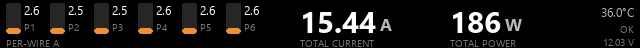
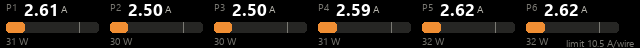

# WireView Pro II on the Corsair iCUE Nexus

Shows live **per-wire current**, **total current** and **total power** from a
[Thermal Grizzly WireView Pro II](https://www.thermal-grizzly.com/en/wireview-pro-ii-gpu/s-tg-wv-p2-h19n)
on the 640×48 [Corsair iCUE Nexus](https://www.corsair.com/us/en/p/pc-components-accessories/ch-9910010-na/icue-nexus-companion-touch-screen-ch-9910010-na)
touch strip.





iCUE offers no way to put third-party sensors or web content on the Nexus, so this daemon
paints the panel itself: it renders a 640×48 frame with Pillow and sends it over HID using the
protocol reverse-engineered by [nexus-open](https://github.com/mantonx/nexus-open). Readings
come **straight from the WireView over USB serial**; no HWiNFO, no Thermal Grizzly app, no
driver changes.

## Install

One command, in PowerShell:

```
powershell -ExecutionPolicy Bypass -c "irm https://raw.githubusercontent.com/jlobue10/wireview-nexus/main/install.ps1 | iex"
```

It downloads this repository to `%LOCALAPPDATA%\wireview-nexus`, installs Python 3.12 with
winget if no Python 3.10+ is present, creates a venv with the three packages, registers a
per-user Scheduled Task named "WireView Nexus" that runs the daemon at logon (no admin rights
needed), and starts it. Then:

1. **Close the Thermal Grizzly WireView app** and turn off its auto-start. Only one program
   can hold the WireView's USB serial port.
2. In iCUE, give the Nexus an **empty screen** (no widgets, black background) so iCUE stops
   redrawing over the daemon's frames. Otherwise the two fight and the panel flickers.

Pick a layout or pass options:

```
powershell -ExecutionPolicy Bypass -c "& ([scriptblock]::Create((irm https://raw.githubusercontent.com/jlobue10/wireview-nexus/main/install.ps1))) -Layout per-wire -ExtraArgs '--fps 4'"
```

Re-running the installer updates the files and restarts the daemon. Remove everything with
`install.ps1 -Uninstall` (from `%LOCALAPPDATA%\wireview-nexus`).

The installer fetches the latest tagged release (or `main` while there is none) and prints the
archive's SHA-256. To install exactly what you reviewed, pass `-Ref <tag|branch|commit>` and
optionally `-Sha256 <hash>`:

```
powershell -ExecutionPolicy Bypass -c "& ([scriptblock]::Create((irm https://raw.githubusercontent.com/jlobue10/wireview-nexus/main/install.ps1))) -Ref v1.0.0 -Sha256 <hash>"
```

<details>
<summary>Manual setup from a clone</summary>

```
python -m venv venv
venv\Scripts\pip install -r requirements.txt
venv\Scripts\python nexus_wireview.py --layout combined --preview test.png   # no Nexus needed
venv\Scripts\python nexus_wireview.py --layout combined
powershell -ExecutionPolicy Bypass -File install.ps1 -Layout combined   # venv + run at logon
```

The last line does the same steps in place. `-NoStart` registers without starting.
</details>

## Where the readings come from

```
WireView Pro II ──USB serial (COMx, 115200 8N1)──▶ nexus_wireview.py ──HID frames──▶ iCUE Nexus
```

`--source` picks the reader (default `auto`, tried in this order):

| Source | What it does |
|---|---|
| `bridge` | Asks a running [wireview-xeneon-edge](https://github.com/jlobue10/wireview-xeneon-edge) bridge at `http://localhost:8765/api/wireview`. Use this when both projects run on one PC: the bridge owns the device and the Nexus daemon shares its readings. The reply is type-checked before use, and the request never goes through an `HTTP_PROXY`. |
| `serial` | Opens the WireView's COM port directly (`wireview_serial.py`). Auto-detects the port by USB ID 0483:5740; `--serial-port COM5` overrides. |
| `hwinfo` | Reads HWiNFO64 shared memory (`hwinfo_wireview.py`, HWiNFO 8.41+ with Shared Memory Support on). Kept as a fallback for setups where HWiNFO must keep the device. |

In `auto` mode the daemon retries a busy or unplugged port every two seconds, and lets go of
the port as soon as a bridge appears so the bridge can take it. While this daemon (or the
bridge) holds the port, HWiNFO's own WireView sensor stops updating; it resumes when the
port is released.

The serial protocol is the one recovered by the Linux community projects
[wireview-pro-ii](https://github.com/Gustav0ar/wireview-pro-ii) (`docs/protocol.md`) and
[wireview-hwmon](https://github.com/emaspa/wireview-hwmon); this daemon uses only the
read-only commands (vendor data, UID, build info, sensor values) plus "resume display
updates". The 100-byte sensor frame carries per-pin voltage/current/power, totals, average
voltage, in/out and two external temperatures, fan duty, the cable's power rating and both
fault masks. Reads take well under a millisecond.

## Options

| Option | Default | Meaning |
|---|---|---|
| `--layout` | `combined` | `combined`, `per-wire`, `total-current`, `total-power` |
| `--wire-limit` | `10.5` | Amps per wire treated as 100 % |
| `--total-limit` | `55` | Amps total treated as 100 % |
| `--cable-w` | cable's own rating | Cable rating in W (the WireView reports 600/450/300/150) |
| `--fps` | `2` | Frames per second |
| `--brightness` | | Panel backlight 0–100, set once at start |
| `--source` | `auto` | `auto`, `bridge`, `serial`, `hwinfo` |
| `--serial-port` | auto-detect | COM port of the WireView |
| `--bridge-url` | `http://localhost:8765/api/wireview` | Bridge to ask in `auto`/`bridge` mode |
| `--preview PNG` | | Render one frame to a file and exit (`--demo` for sample data) |

Bars turn to the warning colour at 80 % of a limit and to critical at 100 %, always with a
text label. Device fault flags (over-current, over-power, over-temperature, imbalance) replace
the temperature readout in red.

## Companion project

[wireview-xeneon-edge](https://github.com/jlobue10/wireview-xeneon-edge) shows the same
readings on a Corsair Xeneon Edge through iCUE's iFrame widget, and its `bridge/` serves the
readings as JSON on localhost. `wireview_serial.py`, `wireview_source.py` and
`hwinfo_wireview.py` are identical in both repositories.

## License

MIT. Nexus protocol details from nexus-open (MIT); WireView serial protocol details from
wireview-pro-ii and wireview-hwmon (MIT).
